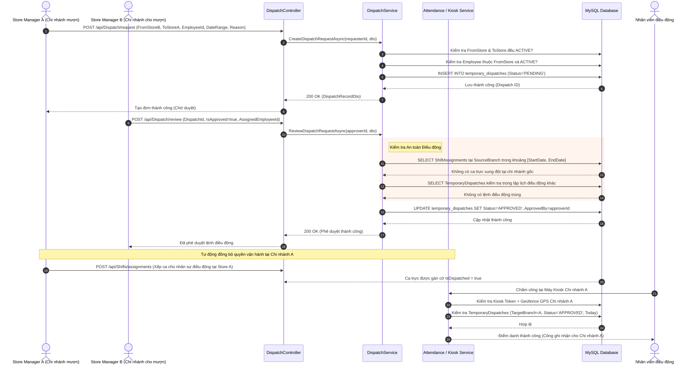

# TÀI LIỆU ĐẶC TẢ CÁC LUỒNG NGHIỆP VỤ HỆ THỐNG R-WFM
## Phân tích Chi tiết Luồng Khai báo Nhân sự, Điều động Liên chi nhánh và Quản lý Điểm siêu thị

---

## MỤC LỤC
1. [Tổng quan Các Luồng Nghiệp vụ Đang Hoạt động](#i-tổng-quan-các-luồng-nghiệp-vụ-đang-hoạt-động)
2. [Luồng Khai báo Nhân sự (UC 1.4 & UC 1.5)](#ii-chi-tiết-luồng-khai-báo-nhân-sự-uc-14--uc-15)
3. [Luồng Điều động Nhân sự Liên chi nhánh (UC 4.1 – UC 4.4)](#iii-chi-tiết-luồng-điều-động-nhân-sự-liên-chi-nhánh-uc-41--uc-44)
4. [Biểu đồ Tuần tự (Sequence Diagrams)](#iv-biểu-đồ-tuần-tự-sequence-diagrams)
   - [Sequence Diagram 1: Khai báo Nhân sự](#1-sequence-diagram-khai-báo-nhân-sự)
   - [Sequence Diagram 2: Điều động Nhân sự Liên chi nhánh](#2-sequence-diagram-điều-động-nhân-sự-liên-chi-nhánh)
5. [Luồng Quản lý Điểm siêu thị (Chi nhánh & Kiosk - UC 1.2)](#v-luồng-quản-lý-điểm-siêu-thị-chi-nhánh--kiosk---uc-12)
6. [Tác động của Quản lý Điểm siêu thị đến Khai báo & Điều động Nhân sự](#vi-tác-động-của-quản-lý-điểm-siêu-thị-đến-khai-báo--điều-động-nhân-sự)

---

## I. TỔNG QUAN CÁC LUỒNG NGHIỆP VỤ ĐANG HOẠT ĐỘNG

Dự án **`hrm_r_wfm_be`** được xây dựng trên nền tảng **.NET 8** theo kiến trúc **Modular Monolith** kết hợp Domain-Driven Design (Clean Architecture). Toàn bộ hệ thống hiện đang vận hành 6 phân hệ cốt lõi:

```
hrm_r_wfm_be/modules/
├── Auth/         # Xác thực JWT, Quản trị tài khoản & Khai báo hồ sơ nhân sự (UC 1.4, UC 1.5)
├── Stores/       # Quản lý danh mục Chi nhánh, Phân cấp quy mô & Cấu hình Kiosk (UC 1.2)
├── Shifts/       # Chuẩn hóa Khung ca mẫu, Lập lịch tuần/tháng & Ma trận Roster (UC 1.3, UC 2.x)
├── Attendance/   # Điểm danh Kiosk đa lớp (Token + GPS Geofence + IP Whitelist + OTP + Ảnh S3)
├── Dispatch/     # Điều động nhân sự tạm thời liên chi nhánh & Giám sát ma trận (UC 4.x)
└── Handovers/    # Số hóa biên bản bàn giao ca (Két tiền mặt & An ninh niêm phong)
```

### 1. Phân hệ Quản trị Tài khoản & Hồ sơ Nhân sự (`modules/Auth`)
- **Tài liệu & Controller**: `modules/Auth/Controllers/UsersController.cs`, `modules/Auth/Services/UserService.cs`.
- **Nghiệp vụ**:
  - Xác thực đa kênh: Đăng nhập truyền thống (Email/Password), Google OAuth2, đổi mật khẩu, quên mật khẩu gửi mã OTP qua Redis/Email.
  - **UC 1.4**: Cấp tài khoản quản trị cho Cửa hàng trưởng (`Store Manager`), khóa/mở khóa tài khoản, reset mật khẩu, tự động gửi email chào mừng (Welcome Email).
  - **UC 1.5**: Khai báo và quản lý hồ sơ nhân sự theo 5 vai trò vận hành tại cửa hàng, phân quyền theo cấp bậc.

### 2. Phân hệ Quản lý Điểm siêu thị & Thiết bị Kiosk (`modules/Stores`)
- **Tài liệu & Controller**: `modules/Stores/Controllers/BranchesController.cs`, `modules/Stores/Services/BranchService.cs`, `modules/Stores/Controllers/KiosksController.cs`.
- **Nghiệp vụ**:
  - **UC 1.2**: CRUD danh mục chi nhánh, mã định danh duy nhất (`BranchCode`), địa chỉ, tọa độ GPS không gian (`NetTopologySuite Point SRID 4326`) và bán kính Geofence (mặc định 50m).
  - Phân cấp quy mô chi nhánh (`BranchTier`: Tier 1 – Lớn, Tier 2 – Tiêu chuẩn, Tier 3 – Nhỏ) kèm API thống kê mạng lưới (`/api/v1/branches/tier-summary`).
  - Quản lý máy trạm Kiosk quầy: Sinh mã trạm tự động (`CHxx-POSyy`), cấp mã token bí mật (`kiosk_token`), kiểm soát dải IP Whitelist và User-Agent lockdown.

### 3. Phân hệ Chuẩn hóa Khung ca & Lập lịch làm việc (`modules/Shifts`)
- **Tài liệu & Controller**: `modules/Shifts/Controllers/ShiftTemplatesController.cs`, `modules/Shifts/Services/ShiftService.cs`, `modules/Shifts/Services/ShiftSchedulerSolver.cs`.
- **Nghiệp vụ**:
  - **UC 1.3**: Chuẩn hóa bộ khung ca mẫu toàn chuỗi, tự động nhận diện ca qua đêm (`IsOvernight`), xóa mềm (`Soft-deactivate`), tự động chuẩn hóa 3 ca mẫu: `CA_SANG`, `CA_CHIEU`, `CA_DEM`.
  - Lập lịch làm việc tuần, xếp ca tự động bằng thuật toán bộ giải (`ShiftSchedulerSolver`), xem lưới ma trận lịch tháng (`GetMonthlyRosterMatrixAsync`), xử lý đổi ca (`ShiftSwapRequest`) và đăng ký ca mở (`OpenShifts`).

### 4. Phân hệ Điểm danh & Chấm công Kiosk (`modules/Attendance`)
- **Tài liệu & Controller**: `modules/Attendance/Controllers/AttendanceController.cs`, `modules/Attendance/Controllers/AttendanceOtpController.cs`, `modules/Attendance/Services/AttendanceService.cs`.
- **Nghiệp vụ**:
  - Chấm công vào/ra ca (Check-in/Check-out) tại Kiosk với cơ chế xác thực an ninh 4 lớp: Kiosk Token hợp lệ + Kiểm tra khoảng cách GPS Geofence + IP Whitelist + Mã OTP xác nhận.
  - Tích hợp chụp ảnh chân dung bằng camera Kiosk, tải ảnh lên AWS S3 và sinh Presigned URL tạm thời.
  - Bảng theo dõi quân số hiện diện trực tiếp tại cửa hàng (Live Roster), tra cứu lịch trình tuần và lịch sử công cá nhân.

### 5. Phân hệ Điều động Nhân sự Liên chi nhánh (`modules/Dispatch`)
- **Tài liệu & Controller**: `modules/Dispatch/Controllers/DispatchController.cs`, `modules/Dispatch/Services/DispatchService.cs`.
- **Nghiệp vụ**:
  - **UC 4.1**: Tạo yêu cầu chi viện nhân sự giữa 2 cửa hàng.
  - **UC 4.2**: Phê duyệt/Từ chối đơn điều động kèm kiểm tra xung đột ca trực tại chi nhánh gốc.
  - **UC 4.3**: Tự động đồng bộ quyền hạn check-in và xếp ca tại chi nhánh mượn.
  - **UC 4.4**: Bảng điều khiển giám sát ma trận điều chuyển và tổng số giờ công chi viện toàn mạng lưới.

### 6. Phân hệ Số hóa Biên bản Bàn giao Ca (`modules/Handovers`)
- **Tài liệu & Controller**: `modules/Handovers/Controllers/HandoversController.cs`, `modules/Handovers/Services/HandoverService.cs`.
- **Nghiệp vụ**:
  - Lập và ký số biên bản bàn giao giữa 2 ca liên tiếp: Kiểm đếm tiền mặt két thu ngân (`CashHandover`), kiểm tra an ninh, cửa cuốn, kho hàng, xe qua đêm (`SecurityHandover`).

---

## II. CHI TIẾT LUỒNG KHAI BÁO NHÂN SỰ & QUẢN LÝ ĐỊNH BIÊN (HEADCOUNT MANAGEMENT)

### 1. Phân cấp Vai trò & Nguyên tắc Phân quyền (RBAC)
Hệ thống chuẩn hóa 7 vai trò người dùng:
1. `OPERATIONS_ADMIN`: Quản trị vận hành chuỗi.
2. `BUSINESS_OWNER`: Chủ doanh nghiệp / Giám đốc điều hành.
3. `STORE_MANAGER`: Cửa hàng trưởng.
4. `SHIFT_LEADER`: Trưởng ca vận hành.
5. `CASHIER`: Thu ngân.
6. `SALES_STAFF`: Nhân viên quầy kệ / Bán hàng.
7. `SECURITY_GUARD`: Nhân viên bảo vệ.

#### Nguyên tắc phân quyền nghiêm ngặt (RBAC Enforcement):
- **Chỉ duy nhất `OPERATIONS_ADMIN`**:
  - Được phép gọi API tạo mới tài khoản nhân sự (`POST /api/v1/users/employees` và alias `POST /api/Users/employees`).
  - Được phép cấp mới tài khoản Cửa hàng trưởng (`POST /api/Users/store-managers`).
  - Được quyền thẩm định, phê duyệt (toàn bộ hoặc một phần) hoặc từ chối các đơn đề xuất mở rộng định biên.
- **`STORE_MANAGER` (Cửa hàng trưởng)**:
  - **Bị cấm tạo nhân sự trực tiếp**: Mọi nỗ lực gọi API tạo nhân sự đều bị chặn với mã phản hồi `403 Forbidden` / `400 Bad Request`.
  - **Quyền hạn duy nhất về nhân sự**: Gửi đơn đề xuất mở rộng định biên (`POST /api/v1/headcount-requests/upload`) đính kèm file Excel (.xlsx) để xin cấp thêm nhân lực khi chi nhánh có nhu cầu tăng quân số.

---

### 2. Cơ chế Định biên Chuẩn theo Quy mô Chi nhánh (BranchTier Quota)
Hệ thống tự động xác định định biên nhân sự chuẩn (Standard Headcount Quota) dựa theo phân cấp quy mô `BranchTier`:
- **Tier 1 (Đại siêu thị / Flagship Store)**: Định biên chuẩn tối đa **30** nhân sự.
- **Tier 2 (Siêu thị tiêu chuẩn - Standard Store)**: Định biên chuẩn tối đa **15** nhân sự.
- **Tier 3 (Cửa hàng tiện lợi mini - Express Store)**: Định biên chuẩn tối đa **8** nhân sự.

Quân số hoạt động thực tế (`CurrentHeadcount`) được tính bằng:
$$\text{CurrentHeadcount} = \sum \text{Users}(\text{HomeBranchId} = \text{BranchId} \land \text{Status} = \text{'ACTIVE'})$$

---

### 3. Logic Bù đắp Định biên Chuẩn (Headcount Attrition Compensation)
Quy chuẩn vận hành quan trọng dành cho đội ngũ phát triển và QA/Testing:

> [!NOTE]
> **Kịch bản bù đắp quân số tự nhiên**:
> - **Giả định**: Chi nhánh Tier 3 có định biên chuẩn $\text{Quota} = 8$. Hiện tại chi nhánh đang có đủ 8 nhân sự hoạt động ($\text{CurrentHeadcount} = 8$ - trạng thái OPTIMAL).
> - **Biến động**: Khi 1 nhân viên nghỉ việc hoặc chấm dứt hợp đồng, Quản trị viên chuyển trạng thái nhân sự này sang `INACTIVE` (`PATCH /api/Users/{id}/status`).
> - **Cơ chế tự động**: Lúc này chỉ số $\text{CurrentHeadcount}$ của chi nhánh tự động giảm từ $8 \rightarrow 7$.
> - **Kết luận nghiệp vụ**: Chi nhánh tự động dôi ra 1 vị trí trống ($\text{AvailableQuotaSlots} = 1$). `OPERATIONS_ADMIN` có thể **tạo ngay 1 nhân sự mới** để thay thế trong phạm vi định biên chuẩn mà **hoàn toàn KHÔNG cần thông qua luồng Import Request**.

---

### 4. Luồng Xử lý Đơn Mở rộng Định biên (Headcount Expansion & Override Workflow)

Khi chi nhánh đã đạt giới hạn định biên chuẩn ($\text{CurrentHeadcount} \ge \text{StandardQuota}$):
1. **Store Manager upload đề xuất (`POST /api/v1/headcount-requests/upload`)**:
   - Đính kèm file Excel (.xlsx), số lượng nhân sự đề xuất (`TotalRequested`), lý do giải trình.
   - File upload được lưu an toàn trên hệ thống lưu trữ (AWS S3 / Local Storage).
   - Bản ghi được tạo trong bảng `headcount_import_requests` với trạng thái `PENDING`.
2. **Operations Admin thẩm định & Phê duyệt (`POST /api/v1/headcount-requests/{id}/review`)**:
   - **Từ chối (Reject)**: Nếu lý do không hợp lý, Admin từ chối kèm lý do $\rightarrow$ `Status = 'REJECTED'`.
   - **Phê duyệt một phần (Partial Approval)**: Admin có quyền duyệt số lượng linh hoạt thay vì duyệt toàn bộ (ví dụ: Store Manager đề xuất +5, Admin chỉ duyệt +3). Lúc này `ApprovedQuantity = 3`, `AdditionalQuantity = 3`, `Status = 'APPROVED'`.
   - **Quản lý hạn dùng (Quota Expiration)**: Đơn được gán thời hạn hiệu lực (`ExpiresAt`, mặc định 30 ngày). Quá thời hạn này, đơn tự động chuyển thành `EXPIRED` và không được phép sử dụng.
3. **Admin tạo nhân sự vượt định biên (`POST /api/v1/users/employees`)**:
   - Khi tạo nhân viên vượt Quota, Admin **bắt buộc** phải truyền `ImportRequestId` (thuộc đơn hợp lệ của chi nhánh) và `ExpansionReason`.
   - Hệ thống tự động trừ lùi chỉ tiêu khả dụng:
     $$\text{AdditionalQuantity} \leftarrow \text{AdditionalQuantity} - 1$$
     $$\text{TotalApproved} \leftarrow \text{TotalApproved} + 1$$
   - Khi $\text{AdditionalQuantity} = 0$, trạng thái đơn tự động chuyển sang `'EXHAUSTED'`. Hệ thống ngăn chặn tuyệt đối việc sử dụng tiếp đơn này.

---

### 5. Bảng Kịch bản Kiểm thử Nghiệp vụ (QA Test Cases)

| Mã TC | Tên Kịch bản Kiểm thử | Thao tác & Dữ liệu đầu vào | Kết quả Kỳ vọng |
| :---: | :--- | :--- | :--- |
| **TC-HC-01** | Chặn Store Manager tạo nhân sự trực tiếp | `STORE_MANAGER` gọi `POST /api/v1/users/employees` | Trả về `403 Forbidden` / `400 Bad Request` ("Chỉ duy nhất OPERATIONS_ADMIN mới có quyền tạo mới...") |
| **TC-HC-02** | Store Manager upload file Excel xin tăng định biên | `STORE_MANAGER` nộp file `.xlsx`, `TotalRequested = 5`, lý do | Trả về `201 Created`, bản ghi lưu `Status = 'PENDING'`, `AdditionalQuantity = 5` |
| **TC-HC-03** | Chặn Admin tạo NV khi đã đủ Quota mà không có đơn | Chi nhánh Tier 3 có 8 NV ACTIVE. Admin gọi tạo NV (không truyền `ImportRequestId`) | Trả về `400 Bad Request` ("Chi nhánh đã đạt giới hạn định biên...") |
| **TC-HC-04** | Admin duyệt một phần đơn mở rộng (Partial Approval) | Admin gọi review: `IsApproved = true`, `ApprovedQuantity = 3` (gốc là 5) | Đơn chuyển `APPROVED`, `ApprovedQuantity = 3`, `AdditionalQuantity = 3` |
| **TC-HC-05** | Admin tạo NV vượt Quota kèm đơn hợp lệ | Admin tạo NV kèm `ImportRequestId`, `ExpansionReason` | Tạo NV thành công (`201 Created`), `AdditionalQuantity` giảm từ 3 xuống 2 |
| **TC-HC-06** | Tự động chuyển trạng thái EXHAUSTED khi hết suất | Admin tạo đủ số lượng suất còn lại của đơn | `AdditionalQuantity` về 0, đơn tự động chuyển `Status = 'EXHAUSTED'` |
| **TC-HC-07** | Chặn dùng đơn đã EXHAUSTED hoặc EXPIRED | Admin cố tạo NV dùng đơn đã hết suất hoặc đã quá `ExpiresAt` | Trả về `400 Bad Request` ("Đơn mở rộng định biên đã hết chỉ tiêu / hết hạn") |
| **TC-HC-08** | Bù đắp định biên khi nhân viên nghỉ việc | Chi nhánh Tier 3 có 8 NV. 1 NV chuyển sang `INACTIVE` (còn 7). Admin tạo NV mới | Tạo NV thành công ngay lập tức **không cần** `ImportRequestId` vì $7 < 8$ (Tier Quota) |
| **TC-HC-09** | Admin từ chối đơn đề xuất (Reject Request) | Admin gọi review: `IsApproved = false`, lý do từ chối | Đơn chuyển `Status = 'REJECTED'`, ghi nhận `AdminNotes` |


---

## III. CHI TIẾT LUỒNG ĐIỀU ĐỘNG NHÂN SỰ LIÊN CHI NHÁNH (UC 4.1 – UC 4.4)

### 1. Bản chất Nghiệp vụ
Điều động nhân sự liên chi nhánh (Temporary Dispatch) là cơ chế cho phép chi nhánh thiếu hụt nhân sự tạm thời (do ốm đau, lượng khách tăng đột biến, sự kiện khuyến mãi) có thể mượn nhân sự từ chi nhánh có dư quân số trong một khoảng thời gian xác định $[StartDate, EndDate]$ mà **không làm thay đổi biên chế gốc (`HomeBranchId`)** của nhân sự đó.

### 2. Các Bước Thực thi Nghiệp vụ

#### Bước 1: Tạo phiếu đề nghị chi viện (UC 4.1)
- **API**: `POST /api/Dispatch/request`
- **Người thực hiện**: Store Manager chi nhánh thiếu người (Target Branch).
- **Quy tắc kiểm tra**:
  - `FromStoreId != ToStoreId` (không điều động nội bộ).
  - `StartDate <= EndDate` và `StartDate >= Today` (không điều động cho ngày trong quá khứ).
  - Cả hai chi nhánh `FromStoreId` và `ToStoreId` đều phải đang `ACTIVE`.
  - Nhân sự được đề xuất phải thuộc biên chế của chi nhánh cho mượn (`user.HomeBranchId == FromStoreId`) và có `Status == "ACTIVE"`.
- Bản ghi `temporary_dispatches` được tạo với trạng thái `PENDING`.

#### Bước 2: Hiệu chỉnh / Hủy đơn khi đang chờ duyệt
- Khi đơn đang ở trạng thái `PENDING`:
  - Bên tạo đơn hoặc Admin có thể điều chỉnh ngày, nhân sự, lý do (`PUT /api/Dispatch/request/{id}`).
  - Bên tạo đơn hoặc Admin có thể hủy đơn (`DELETE /api/Dispatch/request/{id}`).

#### Bước 3: Thẩm định & Phê duyệt / Từ chối (UC 4.2)
- **API**: `POST /api/Dispatch/review`
- **Người thực hiện**: Store Manager chi nhánh cho mượn (Source Branch).
- **Xử lý từ chối**: Chuyển trạng thái sang `REJECTED`, lưu lý do từ chối.
- **Xử lý phê duyệt (`APPROVED`)**: Quản lý có thể chấp thuận nhân viên được đề xuất hoặc chỉ định nhân viên thay thế (`AssignedEmployeeId`) thuộc chi nhánh mình.
- **2 Ràng buộc an toàn bắt buộc khi duyệt**:
  1. **Chặn xung đột ca trực tại chi nhánh gốc**: Quét bảng `shift_assignments`. Nếu nhân viên đã có ca trực hợp lệ tại chi nhánh gốc trong khoảng $[StartDate, EndDate]$, hệ thống **chặn phê duyệt** và yêu cầu Quản lý gỡ ca trực gốc trước.
  2. **Chặn điều động kép**: Nhân viên không được có một lệnh điều động `APPROVED` nào khác đang trùng lặp thời gian.

#### Bước 4: Tự động đồng bộ quyền hạn vận hành (UC 4.3)
Ngay khi lệnh điều động chuyển sang `APPROVED`:
1. **Tìm kiếm tại Kiosk (`SearchStoreEmployeesAsync`)**: Máy Kiosk tại chi nhánh mượn tự động hiển thị gợi ý nhân viên điều động trong danh sách điểm danh.
2. **Xếp ca tại chi nhánh mượn (`ShiftService`)**: Store Manager chi nhánh mượn được phép xếp ca cho nhân viên điều động trong ma trận lịch tháng ([GetMonthlyRosterMatrixAsync](file:///e:/SWP391/Project/hrm_r_wfm_be/modules/Shifts/Services/ShiftService.cs#L646)), hệ thống tự động gắn cờ `IsDispatched = true`.
3. **Chấm công Kiosk (`AttendanceOtpController`)**: Khi nhân viên yêu cầu mã OTP để điểm danh, hệ thống nhận diện có lệnh điều động hôm nay và bắt buộc nhân viên điểm danh theo ca tại chi nhánh nhận (`TargetBranch`).
4. **Bảng công & Lịch làm việc**: Toàn bộ dữ liệu ca trực và giờ làm việc tại chi nhánh nhận được đánh dấu cờ `IsDispatched = true` để phục vụ hạch toán chi phí lương giữa hai chi nhánh.

#### Bước 5: Giám sát ma trận & chỉ số mạng lưới (UC 4.4)
- **API**: `GET /api/Dispatch/network-metrics`
- Cung cấp ma trận điều chuyển giữa các cặp chi nhánh (Source $\rightarrow$ Target), thống kê số lượt điều động, tổng số giờ công chi viện (quy đổi 8 giờ/ngày) giúp Operations Admin và Business Owner đánh giá mức độ tương trợ giữa các cửa hàng.

---

## IV. BIỂU ĐỒ TUẦN TỰ (SEQUENCE DIAGRAMS)

### 1. Sequence Diagram: Khai báo Nhân sự

```mermaid
sequenceDiagram
    autonumber
    actor Actor as Operations Admin / Store Manager
    participant UI as Frontend Client (React)
    participant Ctrl as UsersController
    participant Svc as UserService
    participant DB as MySQL Database
    participant Email as EmailService (SMTP)

    Actor->>UI: Nhập thông tin nhân viên (Mã NV, Họ tên, Email, SĐT, Role, Branch)
    UI->>Ctrl: POST /api/Users/employees (kèm JWT Bearer Token)
    Ctrl->>Svc: CreateEmployeeAsync(dto, actorId, role, branchId)
    
    rect rgb(240, 248, 255)
        note right of Svc: Kiểm tra Nghiệp vụ & Phân quyền
        Svc->>Svc: Kiểm tra Role: Store Manager chỉ được tạo 4 vai trò vận hành
        Svc->>Svc: Gán HomeBranchId theo Store Manager (nếu không phải Admin)
        Svc->>DB: Kiểm tra trùng EmployeeCode, Email, Phone
        DB-->>Svc: Không trùng lặp
        Svc->>DB: Kiểm tra Branch có tồn tại và Status == 'ACTIVE'?
        DB-->>Svc: Branch hợp lệ & đang ACTIVE
    end

    Svc->>Svc: Băm mật khẩu (BCrypt/PBKDF2)
    Svc->>DB: INSERT INTO users (Status='ACTIVE', HomeBranchId, ...)
    DB-->>Svc: Lưu thành công (User ID)
    
    Svc->>DB: INSERT INTO system_audit_logs (Action='CREATE_EMPLOYEE')
    
    Svc-)Email: SendWelcomeEmailAsync (Mã NV, Mật khẩu, Chi nhánh)
    Email-->>Svc: Email gửi thành công / Enqueued
    
    Svc-->>Ctrl: ApiResponse.Ok(EmployeeDetailDto)
    Ctrl-->>UI: 201 Created (Thông tin nhân viên mới)
    UI-->>Actor: Hiển thị thông báo thành công & cập nhật danh sách
```

---

### 2. Sequence Diagram: Điều động Nhân sự Liên chi nhánh



---

## V. LUỒNG QUẢN LÝ ĐIỂM SIÊU THỊ (CHI NHÁNH & KIOSK - UC 1.2)

Phân hệ Quản lý Điểm siêu thị & Thiết bị Kiosk (`modules/Stores`) chịu trách nhiệm thiết lập và kiểm soát hạ tầng mạng lưới bán lẻ vật lý:

1. **Quản trị Danh mục Chi nhánh (Branch Master Data)**:
   - **Tạo mới chi nhánh**: Cấp mã định danh duy nhất `BranchCode` (VD: `CH01`, `CH02`), tên siêu thị, địa chỉ, số điện thoại liên hệ.
   - **Phân cấp quy mô chi nhánh (`BranchTier`)**: Phân loại theo 3 cấp độ quy mô:
     - `Tier 1`: Đại siêu thị / Siêu thị lớn (diện tích lớn, số lượng nhân sự đông, nhiều ca trực).
     - `Tier 2`: Siêu thị tiêu chuẩn (quy mô trung bình).
     - `Tier 3`: Cửa hàng tiện lợi mini (quy mô nhỏ gọn, số lượng nhân sự tinh gọn).
     - Đi kèm API thống kê phân bố mạng lưới: `GET /api/v1/branches/tier-summary`.
   - **Cấu hình Ranh giới Địa lý (GPS Geofencing)**: Lưu tọa độ tâm siêu thị bằng kiểu dữ liệu không gian `NetTopologySuite.Geometries.Point` (WGS84, SRID 4326) gồm `Latitude`, `Longitude` và bán kính cho phép chấm công `GeofenceRadiusMeters` (mặc định 50m).
2. **Quản lý Trạng thái Vòng đời Chi nhánh**:
   - Khóa chi nhánh (`INACTIVE`/`LOCKED`) hoặc Kích hoạt lại (`ACTIVE`) thông qua API `PATCH /api/v1/branches/{id}/status`.
   - Xóa chi nhánh (`DELETE /api/v1/branches/{id}`): Xóa vật lý bản ghi chi nhánh và tự động cascade dữ liệu liên quan.
3. **Quản lý Hạ tầng Máy trạm Kiosk Chấm công**:
   - Quản lý các thiết bị máy tính bảng/máy POS đặt tại quầy thu ngân của từng chi nhánh (`modules/Stores/Controllers/KiosksController.cs`).
   - Tự động sinh mã máy trạm theo mã chi nhánh (ví dụ: `CH01-POS01`, `CH01-POS02`) và mã token bí mật `kiosk_token` (`ksk_tok_{guid}`).
   - Cấu hình an ninh trạm: Dải mạng nội bộ cho phép (`IpWhitelist`) và chuỗi nhận dạng trình duyệt khóa cứng (`UserAgentPattern`).

---

## VI. TÁC ĐỘNG CỦA QUẢN LÝ ĐIỂM SIÊU THỊ ĐẾN KHAI BÁO & ĐIỀU ĐỘNG NHÂN SỰ

Điểm siêu thị (`branches`) là **thực thể trung tâm (Anchor Entity)** định danh mọi quyền hạn, phân bổ ca trực và điểm danh chấm công. Mọi biến động trong cấu hình điểm siêu thị tác động trực tiếp đến hai luồng còn lại:

```
┌─────────────────────────────────────────────────────────────┐
│                   QUẢN LÝ ĐIỂM SIÊU THỊ                      │
│                  (Branch Master Data)                       │
└──────────────┬───────────────────────────────┬──────────────┘
               │                               │
               ▼                               ▼
┌───────────────────────────────┐ ┌───────────────────────────┐
│     KHAI BÁO NHÂN SỰ          │ │   ĐIỀU ĐỘNG NHÂN SỰ       │
│                               │ │                           │
│ • Ràng buộc HomeBranchId      │ │ • SourceBranch (Nơi đi)   │
│ • Kiểm tra branch ACTIVE      │ │ • TargetBranch (Nơi đến)  │
│ • Phạm vi quyền Store Manager │ │ • Xác thực biên chế gốc   │
│ • Unbind khi xóa chi nhánh    │ │ • Kiosk & Geofence đích   │
└───────────────────────────────┘ └───────────────────────────┘
```

### 1. Ảnh hưởng đến Luồng Khai báo Nhân sự

| Hành vi Quản lý Điểm siêu thị | Cơ chế Tác động đến Khai báo Nhân sự | Vị trí Kiểm soát trong Mã nguồn |
| :--- | :--- | :--- |
| **Tạo mới Chi nhánh (`ACTIVE`)** | Mở rộng địa bàn hoạt động. Cho phép tuyển dụng nhân sự mới, bổ nhiệm Cửa hàng trưởng và khai báo nhân viên vận hành vào cơ sở mới này. | [UsersController.cs#L151](file:///e:/SWP391/Project/hrm_r_wfm_be/modules/Auth/Controllers/UsersController.cs#L151) |
| **Phân quyền Khai báo theo Chi nhánh** | Tài khoản Cửa hàng trưởng được gắn chặt với một `HomeBranchId`. Store Manager **chỉ có quyền khai báo nhân viên cho chính chi nhánh mình quản lý**, hệ thống tự động chặn mọi nỗ lực khai báo nhân viên cho chi nhánh khác. | [UserService.cs#L353-L358](file:///e:/SWP391/Project/hrm_r_wfm_be/modules/Auth/Services/UserService.cs#L353-L358) |
| **Khóa Chi nhánh (`INACTIVE`)** | **Chặn toàn bộ việc tuyển dụng/khai báo mới**: Khi gọi tạo Cửa hàng trưởng hoặc nhân viên, hệ thống kiểm tra `branch.Status != "ACTIVE"` $\rightarrow$ Trả về mã lỗi `400 Bad Request` ("Chi nhánh chỉ định không tồn tại hoặc đã ngừng hoạt động"). | [UserService.cs#L365-L369](file:///e:/SWP391/Project/hrm_r_wfm_be/modules/Auth/Services/UserService.cs#L365-L369) |
| **Xóa Chi nhánh (`DELETE`)** | **Cơ chế Unbind an toàn dữ liệu**: Khi xóa một chi nhánh, hệ thống duyệt toàn bộ nhân viên thuộc chi nhánh đó và cập nhật `user.HomeBranchId = null`, biến họ thành "nhân sự tự do" thay vì xóa tài khoản nhân viên hay gây lỗi vi phạm khóa ngoại (Foreign Key Violation). | [BranchService.cs#L264-L268](file:///e:/SWP391/Project/hrm_r_wfm_be/modules/Stores/Services/BranchService.cs#L264-L268) |

### 2. Ảnh hưởng đến Luồng Điều động Nhân sự Liên chi nhánh

| Hành vi Quản lý Điểm siêu thị | Cơ chế Tác động đến Điều động Nhân sự | Vị trí Kiểm soát trong Mã nguồn |
| :--- | :--- | :--- |
| **Định danh Chi nhánh Đi & Chi nhánh Đến** | Lệnh điều động là mối quan hệ giữa 2 điểm siêu thị: `FromStoreId` (Source) và `ToStoreId` (Target). Hệ thống bắt buộc hai chi nhánh phải khác nhau (`FromStoreId != ToStoreId`). | [DispatchService.cs#L24-L27](file:///e:/SWP391/Project/hrm_r_wfm_be/modules/Dispatch/Services/DispatchService.cs#L24-L27) |
| **Xác thực Biên chế Gốc** | Nhân sự được yêu cầu điều động **bắt buộc phải có `HomeBranchId == FromStoreId`**. Hệ thống ngăn chặn tuyệt đối việc mượn một nhân sự không thuộc biên chế của chi nhánh hỗ trợ. | [DispatchService.cs#L56-L59](file:///e:/SWP391/Project/hrm_r_wfm_be/modules/Dispatch/Services/DispatchService.cs#L56-L59) |
| **Khóa 1 trong 2 Chi nhánh (`INACTIVE`)** | Hệ thống lập tức **từ chối tạo mới hoặc cập nhật đơn điều động**: Cả chi nhánh hỗ trợ lẫn chi nhánh nhận đều phải đang `ACTIVE`. Nếu 1 trong 2 cơ sở bị đóng cửa, lệnh điều động bị từ chối ngay lập tức. | [DispatchService.cs#L42-L45](file:///e:/SWP391/Project/hrm_r_wfm_be/modules/Dispatch/Services/DispatchService.cs#L42-L45) |
| **Áp dụng Hạ tầng Kiosk & Geofence Điểm đến** | Khi nhân viên điều động đến làm việc tại chi nhánh nhận, việc chấm công được kiểm soát hoàn toàn bởi cấu hình của chi nhánh nhận: **Tọa độ GPS + bán kính Geofence của Target Branch** và **Kiosk Device Token** của máy trạm đặt tại Target Branch. | [AttendanceOtpController.cs#L58-L76](file:///e:/SWP391/Project/hrm_r_wfm_be/modules/Attendance/Controllers/AttendanceOtpController.cs#L58-L76) |
| **Ma trận Cân bằng Nhân lực Mạng lưới (UC 4.4)** | Dữ liệu ma trận điều động theo cặp chi nhánh kết hợp với phân cấp quy mô `BranchTier` giúp ban điều hành phân tích dòng nhân sự luân chuyển giữa các siêu thị lớn (Tier 1) và các điểm bán nhỏ (Tier 3) để tối ưu hóa chi phí vận hành. | [DispatchService.cs#L313-L327](file:///e:/SWP391/Project/hrm_r_wfm_be/modules/Dispatch/Services/DispatchService.cs#L313-L327) |
