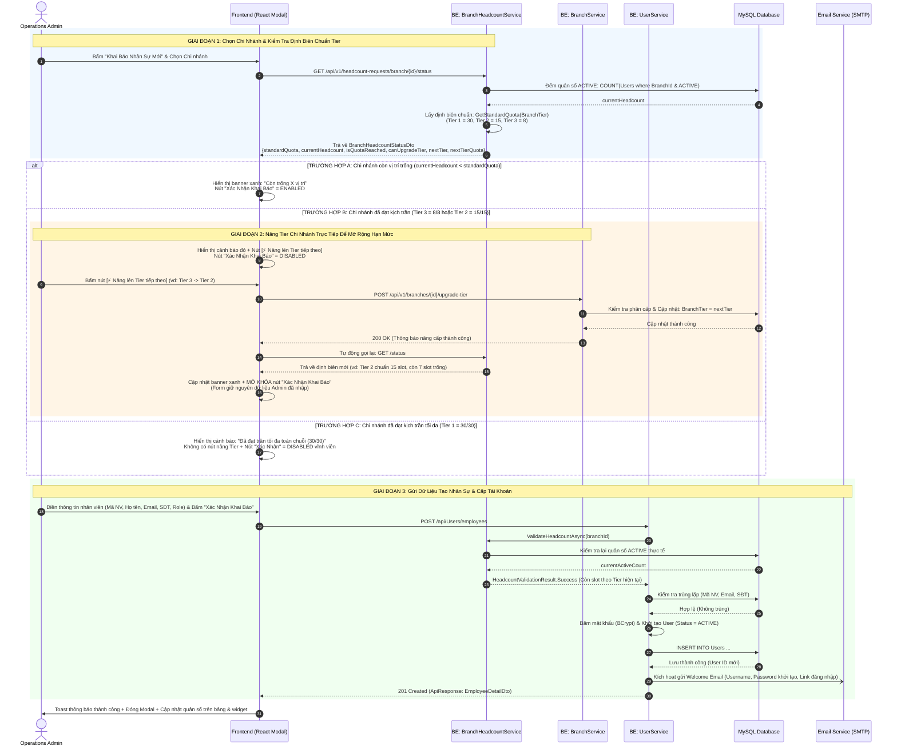
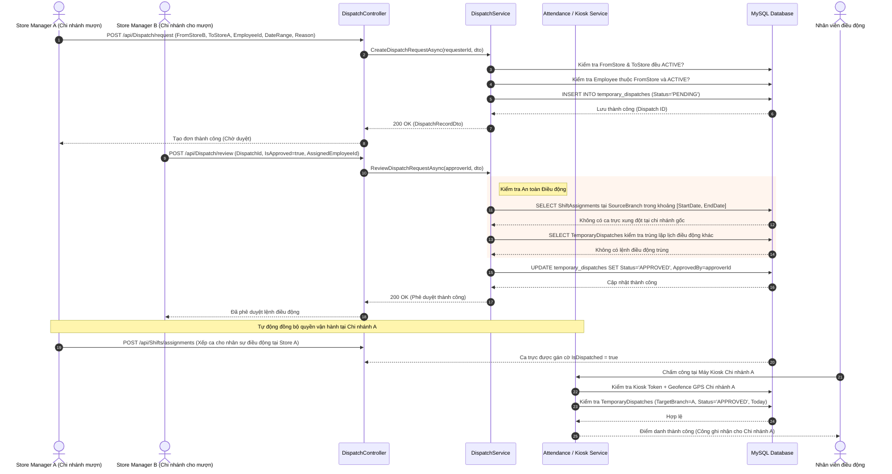

# TÀI LIỆU ĐẶC TẢ CÁC LUỒNG NGHIỆP VỤ HỆ THỐNG R-WFM
## Phân tích Chi tiết Luồng Khai báo Nhân sự, Điều động Liên chi nhánh và Quản lý Điểm siêu thị

---

## MỤC LỤC
1. [Tổng quan Các Luồng Nghiệp vụ Đang Hoạt động](#i-tổng-quan-các-luồng-nghiệp-vụ-đang-hoạt-động)
2. [Luồng Khai báo Nhân sự & Kiểm soát Định biên chuẩn theo Tier (UC 1.4 & UC 1.5)](#ii-chi-tiết-luồng-khai-báo-nhân-sự--kiểm-soát-định-biên-chuẩn-theo-tier-tier-headcount-control)
3. [Luồng Điều động Nhân sự Liên chi nhánh (UC 4.1 – UC 4.4)](#iii-chi-tiết-luồng-điều-động-nhân-sự-liên-chi-nhánh-uc-41--uc-44)
4. [Biểu đồ Tuần tự (Sequence Diagrams)](#iv-biểu-đồ-tuần-tự-sequence-diagrams)
   - [Sequence Diagram 1: Khai báo Nhân sự & Nâng Tier](#1-sequence-diagram-khai-báo-nhân-sự--nâng-tier-chi-nhánh-khi-đạt-định-trần)
   - [Sequence Diagram 2: Điều động Nhân sự Liên chi nhánh](#2-sequence-diagram-điều-động-nhân-sự-liên-chi-nhánh)
5. [Luồng Quản lý Điểm siêu thị (Chi nhánh & Kiosk - UC 1.2)](#v-luồng-quản-lý-điểm-siêu-thị-chi-nhánh--kiosk---uc-12)
6. [Tác động của Quản lý Điểm siêu thị đến Khai báo & Điều động Nhân sự](#vi-tác-động-của-quản-lý-điểm-siêu-thị-đến-khai-báo--điều-động-nhân-sự)

---

## I. TỔNG QUAN CÁC LUỒNG NGHIỆP VỤ ĐANG HOẠT ĐỘNG

Dự án **`hrm_r_wfm_be`** được xây dựng trên nền tảng **.NET 8** theo kiến trúc **Modular Monolith** kết hợp Domain-Driven Design (Clean Architecture). Toàn bộ hệ thống hiện đang vận hành 6 phân hệ cốt lõi:

```
hrm_r_wfm_be/modules/
├── Auth/         # Xác thực JWT, Quản trị tài khoản & Khai báo hồ sơ nhân sự (UC 1.4, UC 1.5)
├── Stores/       # Quản lý danh mục Chi nhánh, Phân cấp quy mô & Cấu hình Kiosk (UC 1.2)
├── Shifts/       # Chuẩn hóa Khung ca mẫu, Lập lịch tuần/tháng & Ma trận Roster (UC 1.3, UC 2.x)
├── Attendance/   # Điểm danh Kiosk đa lớp (Token + GPS Geofence + IP Whitelist + OTP + Ảnh S3)
├── Dispatch/     # Điều động nhân sự tạm thời liên chi nhánh & Giám sát ma trận (UC 4.x)
└── Handovers/    # Số hóa biên bản bàn giao ca (Két tiền mặt & An ninh niêm phong)
```

### 1. Phân hệ Quản trị Tài khoản & Hồ sơ Nhân sự (`modules/Auth`)
- **Tài liệu & Controller**: `modules/Auth/Controllers/UsersController.cs`, `modules/Auth/Services/UserService.cs`.
- **Nghiệp vụ**:
  - Xác thực đa kênh: Đăng nhập truyền thống (Email/Password), Google OAuth2, đổi mật khẩu, quên mật khẩu gửi mã OTP qua Redis/Email.
  - **UC 1.4**: Cấp tài khoản quản trị cho Cửa hàng trưởng (`Store Manager`), khóa/mở khóa tài khoản, reset mật khẩu, tự động gửi email chào mừng (Welcome Email).
  - **UC 1.5**: Khai báo và quản lý hồ sơ nhân sự theo 5 vai trò vận hành tại cửa hàng, phân quyền theo cấp bậc.

### 2. Phân hệ Quản lý Điểm siêu thị & Thiết bị Kiosk (`modules/Stores`)
- **Tài liệu & Controller**: `modules/Stores/Controllers/BranchesController.cs`, `modules/Stores/Services/BranchService.cs`, `modules/Stores/Controllers/KiosksController.cs`.
- **Nghiệp vụ**:
  - **UC 1.2**: CRUD danh mục chi nhánh, mã định danh duy nhất (`BranchCode`), địa chỉ, tọa độ GPS không gian (`NetTopologySuite Point SRID 4326`) và bán kính Geofence (mặc định 50m).
  - Phân cấp quy mô chi nhánh (`BranchTier`: Tier 1 – Lớn, Tier 2 – Tiêu chuẩn, Tier 3 – Nhỏ) kèm API thống kê mạng lưới (`/api/v1/branches/tier-summary`).
  - Quản lý máy trạm Kiosk quầy: Sinh mã trạm tự động (`CHxx-POSyy`), cấp mã token bí mật (`kiosk_token`), kiểm soát dải IP Whitelist và User-Agent lockdown.

### 3. Phân hệ Chuẩn hóa Khung ca & Lập lịch làm việc (`modules/Shifts`)
- **Tài liệu & Controller**: `modules/Shifts/Controllers/ShiftTemplatesController.cs`, `modules/Shifts/Services/ShiftService.cs`, `modules/Shifts/Services/ShiftSchedulerSolver.cs`.
- **Nghiệp vụ**:
  - **UC 1.3**: Chuẩn hóa bộ khung ca mẫu toàn chuỗi, tự động nhận diện ca qua đêm (`IsOvernight`), xóa mềm (`Soft-deactivate`), tự động chuẩn hóa 3 ca mẫu: `CA_SANG`, `CA_CHIEU`, `CA_DEM`.
  - Lập lịch làm việc tuần, xếp ca tự động bằng thuật toán bộ giải (`ShiftSchedulerSolver`), xem lưới ma trận lịch tháng (`GetMonthlyRosterMatrixAsync`), xử lý đổi ca (`ShiftSwapRequest`) và đăng ký ca mở (`OpenShifts`).

### 4. Phân hệ Điểm danh & Chấm công Kiosk (`modules/Attendance`)
- **Tài liệu & Controller**: `modules/Attendance/Controllers/AttendanceController.cs`, `modules/Attendance/Controllers/AttendanceOtpController.cs`, `modules/Attendance/Services/AttendanceService.cs`.
- **Nghiệp vụ**:
  - Chấm công vào/ra ca (Check-in/Check-out) tại Kiosk với cơ chế xác thực an ninh 4 lớp: Kiosk Token hợp lệ + Kiểm tra khoảng cách GPS Geofence + IP Whitelist + Mã OTP xác nhận.
  - Tích hợp chụp ảnh chân dung bằng camera Kiosk, tải ảnh lên AWS S3 và sinh Presigned URL tạm thời.
  - Bảng theo dõi quân số hiện diện trực tiếp tại cửa hàng (Live Roster), tra cứu lịch trình tuần và lịch sử công cá nhân.

### 5. Phân hệ Điều động Nhân sự Liên chi nhánh (`modules/Dispatch`)
- **Tài liệu & Controller**: `modules/Dispatch/Controllers/DispatchController.cs`, `modules/Dispatch/Services/DispatchService.cs`.
- **Nghiệp vụ**:
  - **UC 4.1**: Tạo yêu cầu chi viện nhân sự giữa 2 cửa hàng.
  - **UC 4.2**: Phê duyệt/Từ chối đơn điều động kèm kiểm tra xung đột ca trực tại chi nhánh gốc.
  - **UC 4.3**: Tự động đồng bộ quyền hạn check-in và xếp ca tại chi nhánh mượn.
  - **UC 4.4**: Bảng điều khiển giám sát ma trận điều chuyển và tổng số giờ công chi viện toàn mạng lưới.

### 6. Phân hệ Số hóa Biên bản Bàn giao Ca (`modules/Handovers`)
- **Tài liệu & Controller**: `modules/Handovers/Controllers/HandoversController.cs`, `modules/Handovers/Services/HandoverService.cs`.
- **Nghiệp vụ**:
  - Lập và ký số biên bản bàn giao giữa 2 ca liên tiếp: Kiểm đếm tiền mặt két thu ngân (`CashHandover`), kiểm tra an ninh, cửa cuốn, kho hàng, xe qua đêm (`SecurityHandover`).

---

## II. CHI TIẾT LUỒNG KHAI BÁO NHÂN SỰ & KIỂM SOÁT ĐỊNH BIÊN CHUẨN THEO TIER (TIER HEADCOUNT CONTROL)

### 1. Phân cấp Vai trò & Nguyên tắc Phân quyền (RBAC)
Hệ thống chuẩn hóa 7 vai trò người dùng:
1. `OPERATIONS_ADMIN`: Quản trị vận hành chuỗi.
2. `BUSINESS_OWNER`: Chủ doanh nghiệp / Giám đốc điều hành.
3. `STORE_MANAGER`: Cửa hàng trưởng.
4. `SHIFT_LEADER`: Trưởng ca vận hành.
5. `CASHIER`: Thu ngân.
6. `SALES_STAFF`: Nhân viên quầy kệ / Bán hàng.
7. `SECURITY_GUARD`: Nhân viên bảo vệ.

#### Nguyên tắc phân quyền nghiêm ngặt (RBAC Enforcement):
- **Chỉ duy nhất `OPERATIONS_ADMIN` và `ADMIN`**:
  - Được phép gọi API tạo mới tài khoản nhân sự (`POST /api/v1/users/employees` và alias `POST /api/Users/employees`).
  - Được phép cấp mới tài khoản Cửa hàng trưởng (`POST /api/Users/store-managers`).
  - Được quyền thực hiện nâng phân cấp Tier của chi nhánh (`POST /api/v1/branches/{id}/upgrade-tier`).
- **`STORE_MANAGER` (Cửa hàng trưởng)**:
  - **Bị cấm tạo nhân sự trực tiếp**: Mọi nỗ lực gọi API tạo nhân sự đều bị chặn với mã phản hồi `403 Forbidden` / `400 Bad Request`.
  - **Không có quyền nâng Tier chi nhánh**: Phân cấp chi nhánh là quyết định mang tính chiến lược của Quản trị chuỗi (Operations Admin).

---

### 2. Cơ chế Định biên Chuẩn Cố định theo Phân cấp Chi nhánh (BranchTier Quota)
Hệ thống ấn định định biên nhân sự chuẩn (Standard Headcount Quota) bất biến theo phân cấp quy mô `BranchTier` (`Domain/Constants/HeadcountConstants.cs`):
- **Tier 1 (Đại siêu thị / Flagship Store)**: Định biên chuẩn tối đa **30** nhân sự.
- **Tier 2 (Siêu thị tiêu chuẩn - Standard Store)**: Định biên chuẩn tối đa **15** nhân sự.
- **Tier 3 (Cửa hàng tiện lợi mini - Express Store)**: Định biên chuẩn tối đa **8** nhân sự.

> [!IMPORTANT]
> **Loại bỏ cơ chế nâng trần linh hoạt `StaffCount`**: Hệ thống đã bãi bỏ hoàn toàn việc dùng thuộc tính `StaffCount` để tùy ý nới lỏng trần định biên cho chi nhánh. Mọi hạn mức định biên (`EffectiveQuota`) luôn tuân thủ nghiêm ngặt 100% theo định biên chuẩn của phân cấp Tier (`Tier 1 = 30, Tier 2 = 15, Tier 3 = 8`).

Quân số hoạt động thực tế (`CurrentHeadcount`) được tính toán theo thời gian thực:
$$\text{CurrentHeadcount} = \sum \text{Users}(\text{HomeBranchId} = \text{BranchId} \land \text{Status} = \text{'ACTIVE'})$$

---

### 3. Logic Bù đắp Định biên Tự nhiên (Headcount Attrition Compensation)
Quy chuẩn vận hành quan trọng dành cho đội ngũ phát triển và QA/Testing:

> [!NOTE]
> **Kịch bản bù đắp quân số tự nhiên**:
> - **Giả định**: Chi nhánh Tier 3 có định biên chuẩn $\text{Quota} = 8$. Hiện tại chi nhánh đang có đủ 8 nhân sự hoạt động ($\text{CurrentHeadcount} = 8$ - trạng thái kịch biên).
> - **Biến động**: Khi 1 nhân viên nghỉ việc hoặc chấm dứt hợp đồng, Quản trị viên chuyển trạng thái nhân sự này sang `INACTIVE` (`PATCH /api/Users/{id}/status`).
> - **Cơ chế tự động**: Lúc này chỉ số $\text{CurrentHeadcount}$ của chi nhánh tự động giảm từ $8 \rightarrow 7$.
> - **Kết luận nghiệp vụ**: Chi nhánh tự động dôi ra 1 vị trí trống ($\text{AvailableQuotaSlots} = 1$). `OPERATIONS_ADMIN` có thể **tạo ngay 1 nhân sự mới** để thay thế trong phạm vi định biên chuẩn của Tier 3 mà **hoàn toàn KHÔNG cần phải nâng Tier chi nhánh**.

---

### 4. Cơ chế Nâng Tier Chi Nhánh Khi Đạt Định Trần Kịch Biên (Branch Tier Upgrade Workflow)

Khi chi nhánh đã đạt trần kịch biên định biên ($\text{CurrentHeadcount} \ge \text{StandardQuota}$) và Admin có nhu cầu tuyển dụng thêm nhân sự:

```
┌────────────────────────┐      Đạt trần 8/8       ┌────────────────────────┐      Đạt trần 15/15     ┌────────────────────────┐
│     TIER 3 (Mini)      │ ─────────────────────►  │    TIER 2 (Chuẩn)      │ ─────────────────────►  │     TIER 1 (Lớn)       │
│ Định biên tối đa: 8 NV │   Nâng cấp mở rộng 15   │ Định biên tối đa: 15 NV│   Nâng cấp mở rộng 30   │ Định biên tối đa: 30 NV│
└────────────────────────┘                         └────────────────────────┘                         └───────────┬────────────┘
                                                                                                                  │
                                                                                          Kịch trần tối đa hệ thống (30/30)
                                                                                          KHÔNG THỂ NÂNG THÊM
```

1. **Khóa tạo mới tại Client (Frontend Pre-validation)**:
   - Khi Admin chọn chi nhánh đã đạt trần định biên, hệ thống lập tức khóa nút **"Xác Nhận Khai Báo"** (`disabled = true`).
   - Modal hiển thị banner cảnh báo đỏ và cung cấp nút thao tác nhanh:
     - Với chi nhánh Tier 3: **`[⚡ Nâng lên Tier 2 (15 nhân sự)]`**.
     - Với chi nhánh Tier 2: **`[⚡ Nâng lên Tier 1 (30 nhân sự)]`**.
     - Với chi nhánh Tier 1: Cảnh báo chi nhánh đã ở mức tối đa toàn chuỗi (30/30 kịch trần), không có nút nâng cấp.
2. **Admin thực hiện nâng Tier trực tiếp (`POST /api/v1/branches/{id}/upgrade-tier`)**:
   - Admin nhấn nút nâng Tier ngay trên form khai báo (hoặc tại thẻ `HeadcountQuotaCard`).
   - Backend kiểm tra điều kiện:
     - Nếu đang là Tier 3: Cập nhật `branch.BranchTier = BranchTier.Tier2;` $\rightarrow$ Định biên mở rộng lên **15** nhân sự.
     - Nếu đang là Tier 2: Cập nhật `branch.BranchTier = BranchTier.Tier1;` $\rightarrow$ Định biên mở rộng lên **30** nhân sự.
     - Nếu đang là Tier 1: Trả về lỗi `400 Bad Request` vì đã ở mức tối đa.
3. **Mở khóa hoàn tất khai báo không mất dữ liệu**:
   - Ngay khi API nâng Tier trả về thành công, Frontend tự động cập nhật lại hạn mức định biên mới (từ 8 lên 15 hoặc từ 15 lên 30).
   - Nút **"Xác Nhận Khai Báo" được mở khóa ngay lập tức**.
   - Admin tiếp tục nhấn nút xác nhận để thêm nhân sự mà **không cần đóng modal hay nhập lại dữ liệu đã điền dở**.

---

### 5. Hướng Dẫn Kỹ Thuật Từng Bước & Bản Đồ Mã Nguồn (Step-by-Step Architecture Guide)

```
[UI: EmployeeManagementPage] 
   └── [Modal: EmployeeFormModal] 
          ├── 1. Pre-check Quota: headcountService.getBranchHeadcountStatus()
          │         └── GET /api/v1/headcount-requests/branch/{id}/status 
          │               └── BE: BranchesController -> BranchHeadcountService -> HeadcountConstants
          │
          ├── 2. Nâng Tier (Khi kịch biên): headcountService.upgradeBranchTier()
          │         └── POST /api/v1/branches/{id}/upgrade-tier 
          │               └── BE: BranchesController -> BranchService -> DB (BranchTier)
          │
          └── 3. Bấm Submit Khai Báo: employeeService.createEmployee()
                    └── POST /api/Users/employees 
                          └── BE: UsersController -> UserService -> ValidateHeadcountAsync -> DB (User)
```

#### Chi tiết các thành phần trong mã nguồn:

| Bước xử lý | Phía Client (Frontend React) | Phía Server (Backend .NET 8) | Kiểm tra dữ liệu & Điều kiện |
| :--- | :--- | :--- | :--- |
| **1. Tra cứu định biên** | `EmployeeFormModal.jsx` gọi `headcountService.getBranchHeadcountStatus(branchId)` | `BranchesController.GetBranchHeadcountStatus` $\rightarrow$ `BranchHeadcountService.GetBranchHeadcountStatusAsync` | Đếm quân số ACTIVE: `Users.Count(u => u.HomeBranchId == id && u.Status == "ACTIVE")`. So sánh với `HeadcountConstants.GetStandardQuota(branch.BranchTier)`. Trả về `BranchHeadcountStatusDto`. |
| **2. Nâng Tier khi kịch biên** | Nút `[⚡ Nâng lên Tier ...]` gọi `headcountService.upgradeBranchTier(branchId)` | `BranchesController.UpgradeBranchTier` $\rightarrow$ `BranchService.UpgradeBranchTierAsync` | Kiểm tra `branch.BranchTier > 1`. Nâng Tier 3 $\rightarrow$ Tier 2 hoặc Tier 2 $\rightarrow$ Tier 1. Cập nhật `branch.UpdatedAt = UtcNow`, lưu DB. Trả về thông báo thành công. |
| **3. Kiểm tra form tại FE** | Hàm `validate()` trong `EmployeeFormModal.jsx` | *(Chưa gửi request)* | Kiểm tra bắt buộc: Họ tên, Mã NV, SĐT (9-12 số), Email hợp lệ, Mật khẩu khởi tạo, Vai trò, Chi nhánh công tác. |
| **4. Tiếp nhận & Thẩm định BE** | `employeeService.createEmployee(payload)` gửi `POST /api/Users/employees` | `UsersController.CreateEmployee` $\rightarrow$ `UserService.CreateEmployeeAsync` | 1. Branch phải tồn tại và `Status == "ACTIVE"`.<br>2. Gọi `_headcountService.ValidateHeadcountAsync`: Nếu `projectedCount >= standardQuota` $\rightarrow$ Báo lỗi kịch trần.<br>3. Kiểm tra trùng lặp `EmployeeCode`, `Email`, `Phone`. |
| **5. Tạo tài khoản & Gửi Email** | *(Chờ phản hồi API)* | `UserService.CreateEmployeeAsync` $\rightarrow$ `_context.Users.Add()` $\rightarrow$ `_emailService.SendWelcomeEmailAsync()` | Băm mật khẩu bằng BCrypt, gán `Status = "ACTIVE"`, lưu Database. Kích hoạt gửi Welcome Email có mã NV, mật khẩu và link đăng nhập. Trả về `201 Created`. |

---

### 6. Bảng Kịch bản Kiểm thử Nghiệp vụ (QA Test Cases - Chuẩn FSOFT v2/0)

*Mã tài liệu: 02ae-BM/PM/HDCV/FSOFT v2/0 — Facilitate_Test Case\Employee Headcount Control*

| Mã TC | Tên Kịch bản Kiểm thử | Điều kiện Tiền đề (Pre-conditions) | Các bước Thực hiện (Procedure) | Kết quả Kỳ vọng (Expected Results) |
| :---: | :--- | :--- | :--- | :--- |
| **TC_EMP_HC_001** | Bãi bỏ trường nhập StaffCount trên form chi nhánh | Quyền Admin, mở modal cấu hình chi nhánh (`BranchFormModal`). | 1. Mở modal thêm/sửa chi nhánh.<br>2. Kiểm tra các trường dữ liệu. | Không còn trường `StaffCount`. Phân cấp Tier hiển thị rõ định biên chuẩn cố định (Tier 1 = 30, Tier 2 = 15, Tier 3 = 8). |
| **TC_EMP_HC_002** | Hiển thị định biên chuẩn Tier trên thẻ Quota Card | Quyền Admin, xem trang `/employees`. | 1. Quan sát widget định biên chi nhánh. | Định biên hiển thị chuẩn theo Tier. Không còn nhãn hay số liệu "Quota tùy chỉnh". |
| **TC_EMP_HC_003** | Khai báo nhân sự khi chi nhánh còn vị trí trống | Chi nhánh A (Tier 3) có 5/8 nhân sự (còn 3 slot trống). | 1. Mở modal tạo nhân viên, chọn Chi nhánh A.<br>2. Điền form hợp lệ và bấm Xác nhận. | Banner xanh hiển thị còn 3 slot. Nút tạo mở khóa. Tạo thành công, quân số tăng lên 6/8. Gửi Welcome Email. |
| **TC_EMP_HC_004** | Chặn khai báo nhân sự khi chi nhánh Tier 3 kịch trần (8/8) | Chi nhánh B (Tier 3) đã đủ 8/8 nhân sự. | 1. Chọn Chi nhánh B trên modal tạo nhân viên. | Banner đỏ cảnh báo kịch trần 8/8. Nút "Xác Nhận Khai Báo" bị khóa (Disabled). Hiển thị nút `⚡ Nâng lên Tier 2 (15 nhân sự)`. |
| **TC_EMP_HC_005** | Chặn khai báo nhân sự khi chi nhánh Tier 2 kịch trần (15/15) | Chi nhánh C (Tier 2) đã đủ 15/15 nhân sự. | 1. Chọn Chi nhánh C trên modal tạo nhân viên. | Banner đỏ cảnh báo kịch trần 15/15. Nút submit bị khóa. Hiển thị nút `⚡ Nâng lên Tier 1 (30 nhân sự)`. |
| **TC_EMP_HC_006** | Chặn khai báo khi chi nhánh Tier 1 kịch trần (30/30) | Chi nhánh D (Tier 1) đã đủ 30/30 nhân sự. | 1. Chọn Chi nhánh D trên modal tạo nhân viên. | Banner đỏ cảnh báo kịch trần tối đa toàn chuỗi. Nút submit bị khóa. **Không có nút nâng Tier**. |
| **TC_EMP_HC_007** | Admin nâng Tier 3 lên Tier 2 trực tiếp từ Modal tạo nhân sự | Chi nhánh B (Tier 3) đang đầy 8/8 nhân sự; form nhân viên đã điền xong. | 1. Nhấn nút `⚡ Nâng lên Tier 2 (15 nhân sự)` trên banner.<br>2. Sau khi có toast thành công, bấm "Xác Nhận Khai Báo". | Chi nhánh nâng lên Tier 2 thành công, quota thành 15. Form giữ nguyên dữ liệu đã nhập. Nút Xác nhận mở khóa. Tạo nhân viên thành công, quân số đạt 9/15. |
| **TC_EMP_HC_008** | Admin nâng Tier 2 lên Tier 1 trực tiếp từ Modal tạo nhân sự | Chi nhánh C (Tier 2) đang đầy 15/15 nhân sự. | 1. Nhấn nút `⚡ Nâng lên Tier 1 (30 nhân sự)` trên banner.<br>2. Bấm "Xác Nhận Khai Báo". | Chi nhánh nâng lên Tier 1, quota thành 30. Tạo nhân viên thành công, quân số đạt 16/30. |
| **TC_EMP_HC_009** | Nâng Tier nhanh từ thẻ HeadcountQuotaCard | Chi nhánh B (Tier 3) đang đầy 8/8 nhân sự. | 1. Bấm nút `⚡ Nâng Tier 2 (15)` trên thẻ chi nhánh. | Chi nhánh chuyển sang Tier 2 (15 người). Thẻ chuyển sang trạng thái còn 7 slot. |
| **TC_EMP_HC_010** | Backend chặn nâng cấp đối với chi nhánh đã ở Tier 1 | Chi nhánh D là Tier 1. Gọi API `POST /api/v1/branches/{id}/upgrade-tier`. | Gửi request nâng cấp Tier cho chi nhánh Tier 1. | Backend trả về `400 Bad Request` ("Chi nhánh đã ở phân cấp cao nhất..."). |
| **TC_EMP_HC_011** | Backend chặn tạo nhân viên trực tiếp khi kịch trần qua API | Chi nhánh B (Tier 3) có 8/8 nhân sự. Gọi API `POST /api/Users/employees`. | Gửi request tạo nhân viên vào Chi nhánh B. | Backend trả về `400 Bad Request` kèm thông báo lỗi hướng dẫn nâng Tier. |
| **TC_EMP_HC_012** | Tự động mở slot bù đắp khi nhân sự chuyển sang INACTIVE | Chi nhánh B (Tier 3) có 8/8 nhân sự. 1 nhân viên chuyển sang INACTIVE. | 1. Admin khóa/chuyển trạng thái 1 nhân viên sang INACTIVE.<br>2. Mở modal tạo nhân sự cho Chi nhánh B. | Quân số tự động giảm còn 7/8. Chi nhánh còn 1 slot trống. Nút tạo nhân viên mở khóa bình thường mà không cần nâng Tier. |
| **TC_EMP_HC_013** | Kiểm soát định biên khi Import hàng loạt | Chi nhánh E (Tier 2) có 14/15 nhân viên (còn 1 slot). File Excel có 3 nhân viên. | 1. Thực hiện Import file Excel. | Dòng 1 import thành công (quân số lên 15/15). Dòng 2 và 3 bị chặn và báo lỗi kịch trần định biên. |


---

## III. CHI TIẾT LUỒNG ĐIỀU ĐỘNG NHÂN SỰ LIÊN CHI NHÁNH (UC 4.1 – UC 4.4)

### 1. Bản chất Nghiệp vụ
Điều động nhân sự liên chi nhánh (Temporary Dispatch) là cơ chế cho phép chi nhánh thiếu hụt nhân sự tạm thời (do ốm đau, lượng khách tăng đột biến, sự kiện khuyến mãi) có thể mượn nhân sự từ chi nhánh có dư quân số trong một khoảng thời gian xác định $[StartDate, EndDate]$ mà **không làm thay đổi biên chế gốc (`HomeBranchId`)** của nhân sự đó.

### 2. Các Bước Thực thi Nghiệp vụ

#### Bước 1: Tạo phiếu đề nghị chi viện (UC 4.1)
- **API**: `POST /api/Dispatch/request`
- **Người thực hiện**: Store Manager chi nhánh thiếu người (Target Branch).
- **Quy tắc kiểm tra**:
  - `FromStoreId != ToStoreId` (không điều động nội bộ).
  - `StartDate <= EndDate` và `StartDate >= Today` (không điều động cho ngày trong quá khứ).
  - Cả hai chi nhánh `FromStoreId` và `ToStoreId` đều phải đang `ACTIVE`.
  - Nhân sự được đề xuất phải thuộc biên chế của chi nhánh cho mượn (`user.HomeBranchId == FromStoreId`) và có `Status == "ACTIVE"`.
- Bản ghi `temporary_dispatches` được tạo với trạng thái `PENDING`.

#### Bước 2: Hiệu chỉnh / Hủy đơn khi đang chờ duyệt
- Khi đơn đang ở trạng thái `PENDING`:
  - Bên tạo đơn hoặc Admin có thể điều chỉnh ngày, nhân sự, lý do (`PUT /api/Dispatch/request/{id}`).
  - Bên tạo đơn hoặc Admin có thể hủy đơn (`DELETE /api/Dispatch/request/{id}`).

#### Bước 3: Thẩm định & Phê duyệt / Từ chối (UC 4.2)
- **API**: `POST /api/Dispatch/review`
- **Người thực hiện**: Store Manager chi nhánh cho mượn (Source Branch).
- **Xử lý từ chối**: Chuyển trạng thái sang `REJECTED`, lưu lý do từ chối.
- **Xử lý phê duyệt (`APPROVED`)**: Quản lý có thể chấp thuận nhân viên được đề xuất hoặc chỉ định nhân viên thay thế (`AssignedEmployeeId`) thuộc chi nhánh mình.
- **2 Ràng buộc an toàn bắt buộc khi duyệt**:
  1. **Chặn xung đột ca trực tại chi nhánh gốc**: Quét bảng `shift_assignments`. Nếu nhân viên đã có ca trực hợp lệ tại chi nhánh gốc trong khoảng $[StartDate, EndDate]$, hệ thống **chặn phê duyệt** và yêu cầu Quản lý gỡ ca trực gốc trước.
  2. **Chặn điều động kép**: Nhân viên không được có một lệnh điều động `APPROVED` nào khác đang trùng lặp thời gian.

#### Bước 4: Tự động đồng bộ quyền hạn vận hành (UC 4.3)
Ngay khi lệnh điều động chuyển sang `APPROVED`:
1. **Tìm kiếm tại Kiosk (`SearchStoreEmployeesAsync`)**: Máy Kiosk tại chi nhánh mượn tự động hiển thị gợi ý nhân viên điều động trong danh sách điểm danh.
2. **Xếp ca tại chi nhánh mượn (`ShiftService`)**: Store Manager chi nhánh mượn được phép xếp ca cho nhân viên điều động trong ma trận lịch tháng ([GetMonthlyRosterMatrixAsync](file:///e:/SWP391/Project/hrm_r_wfm_be/modules/Shifts/Services/ShiftService.cs#L646)), hệ thống tự động gắn cờ `IsDispatched = true`.
3. **Chấm công Kiosk (`AttendanceOtpController`)**: Khi nhân viên yêu cầu mã OTP để điểm danh, hệ thống nhận diện có lệnh điều động hôm nay và bắt buộc nhân viên điểm danh theo ca tại chi nhánh nhận (`TargetBranch`).
4. **Bảng công & Lịch làm việc**: Toàn bộ dữ liệu ca trực và giờ làm việc tại chi nhánh nhận được đánh dấu cờ `IsDispatched = true` để phục vụ hạch toán chi phí lương giữa hai chi nhánh.

#### Bước 5: Giám sát ma trận & chỉ số mạng lưới (UC 4.4)
- **API**: `GET /api/Dispatch/network-metrics`
- Cung cấp ma trận điều chuyển giữa các cặp chi nhánh (Source $\rightarrow$ Target), thống kê số lượt điều động, tổng số giờ công chi viện (quy đổi 8 giờ/ngày) giúp Operations Admin và Business Owner đánh giá mức độ tương trợ giữa các cửa hàng.

---

## IV. BIỂU ĐỒ TUẦN TỰ (SEQUENCE DIAGRAMS)

### 1. Sequence Diagram: Khai báo Nhân sự & Nâng Tier Chi Nhánh Khi Đạt Định Trần


```mermaid
sequenceDiagram
    autonumber
    actor Admin as Operations Admin
    participant FE as Frontend (React Modal)
    participant BE_Headcount as BE: BranchHeadcountService
    participant BE_Branch as BE: BranchService
    participant BE_User as BE: UserService
    participant DB as MySQL Database
    participant Email as Email Service (SMTP)

    %% GIAI ĐOẠN 1: MỞ FORM VÀ KIỂM TRA ĐỊNH BIÊN
    rect rgb(240, 248, 255)
    note over Admin, BE_Headcount: GIAI ĐOẠN 1: Chọn Chi Nhánh & Kiểm Tra Định Biên Chuẩn Tier
    Admin->>FE: Bấm "Khai Báo Nhân Sự Mới" & Chọn Chi nhánh
    FE->>BE_Headcount: GET /api/v1/headcount-requests/branch/{id}/status
    BE_Headcount->>DB: Đếm quân số ACTIVE: COUNT(Users where BranchId & ACTIVE)
    DB-->>BE_Headcount: currentHeadcount
    BE_Headcount->>BE_Headcount: Lấy định biên chuẩn: GetStandardQuota(BranchTier)<br/>(Tier 1 = 30, Tier 2 = 15, Tier 3 = 8)
    BE_Headcount-->>FE: Trả về BranchHeadcountStatusDto<br/>{standardQuota, currentHeadcount, isQuotaReached, canUpgradeTier, nextTier, nextTierQuota}
    end

    %% GIAI ĐOẠN 2: XỬ LÝ THEO TRẠNG THÁI ĐỊNH BIÊN
    alt TRƯỜNG HỢP A: Chi nhánh còn vị trí trống (currentHeadcount < standardQuota)
        FE->>FE: Hiển thị banner xanh: "Còn trống X vị trí"<br/>Nút "Xác Nhận Khai Báo" = ENABLED

    else TRƯỜNG HỢP B: Chi nhánh đã đạt kịch trần (Tier 3 = 8/8 hoặc Tier 2 = 15/15)
        rect rgb(255, 245, 230)
        note over Admin, BE_Branch: GIAI ĐOẠN 2: Nâng Tier Chi Nhánh Trực Tiếp Để Mở Rộng Hạn Mức
        FE->>FE: Hiển thị cảnh báo đỏ + Nút [⚡ Nâng lên Tier tiếp theo]<br/>Nút "Xác Nhận Khai Báo" = DISABLED
        Admin->>FE: Bấm nút [⚡ Nâng lên Tier tiếp theo] (vd: Tier 3 -> Tier 2)
        FE->>BE_Branch: POST /api/v1/branches/{id}/upgrade-tier
        BE_Branch->>DB: Kiểm tra phân cấp & Cập nhật: BranchTier = nextTier
        DB-->>BE_Branch: Cập nhật thành công
        BE_Branch-->>FE: 200 OK (Thông báo nâng cấp thành công)
        
        FE->>BE_Headcount: Tự động gọi lại: GET /status
        BE_Headcount-->>FE: Trả về định biên mới (vd: Tier 2 chuẩn 15 slot, còn 7 slot trống)
        FE->>FE: Cập nhật banner xanh + MỞ KHÓA nút "Xác Nhận Khai Báo"<br/>(Form giữ nguyên dữ liệu Admin đã nhập)
        end

    else TRƯỜNG HỢP C: Chi nhánh đã đạt kịch trần tối đa (Tier 1 = 30/30)
        FE->>FE: Hiển thị cảnh báo: "Đã đạt trần tối đa toàn chuỗi (30/30)"<br/>Không có nút nâng Tier + Nút "Xác Nhận" = DISABLED vĩnh viễn
    end

    %% GIAI ĐOẠN 3: XÁC NHẬN KHAI BÁO NHÂN SỰ
    rect rgb(240, 255, 240)
    note over Admin, Email: GIAI ĐOẠN 3: Gửi Dữ Liệu Tạo Nhân Sự & Cấp Tài Khoản
    Admin->>FE: Điền thông tin nhân viên (Mã NV, Họ tên, Email, SĐT, Role) & Bấm "Xác Nhận Khai Báo"
    FE->>BE_User: POST /api/Users/employees
    
    %% Thẩm định phía BE
    BE_User->>BE_Headcount: ValidateHeadcountAsync(branchId)
    BE_Headcount->>DB: Kiểm tra lại quân số ACTIVE thực tế
    DB-->>BE_Headcount: currentActiveCount
    BE_Headcount-->>BE_User: HeadcountValidationResult.Success (Còn slot theo Tier hiện tại)
    
    %% Kiểm tra trùng lặp & Lưu
    BE_User->>DB: Kiểm tra trùng lặp (Mã NV, Email, SĐT)
    DB-->>BE_User: Hợp lệ (Không trùng)
    BE_User->>BE_User: Băm mật khẩu (BCrypt) & Khởi tạo User (Status = ACTIVE)
    BE_User->>DB: INSERT INTO Users ...
    DB-->>BE_User: Lưu thành công (User ID mới)

    %% Gửi Email chào mừng
    BE_User-)Email: Kích hoạt gửi Welcome Email (Username, Password khởi tạo, Link đăng nhập)
    
    BE_User-->>FE: 201 Created (ApiResponse: EmployeeDetailDto)
    end

    %% HOÀN TẤT
    FE->>Admin: Toast thông báo thành công + Đóng Modal + Cập nhật quân số trên bảng & widget
```

---

### 2. Sequence Diagram: Điều động Nhân sự Liên chi nhánh


```mermaid
sequenceDiagram
    autonumber
    actor MgrA as Store Manager A (Chi nhánh mượn)
    actor MgrB as Store Manager B (Chi nhánh cho mượn)
    participant DispCtrl as DispatchController
    participant DispSvc as DispatchService
    participant AttSvc as Attendance / Kiosk Service
    participant DB as MySQL Database

    %% Giai đoạn 1: Đề nghị điều động
    MgrA->>DispCtrl: POST /api/Dispatch/request (FromStoreB, ToStoreA, EmployeeId, DateRange, Reason)
    DispCtrl->>DispSvc: CreateDispatchRequestAsync(requesterId, dto)
    DispSvc->>DB: Kiểm tra FromStore & ToStore đều ACTIVE?
    DispSvc->>DB: Kiểm tra Employee thuộc FromStore và ACTIVE?
    DispSvc->>DB: INSERT INTO temporary_dispatches (Status='PENDING')
    DB-->>DispSvc: Lưu thành công (Dispatch ID)
    DispSvc-->>DispCtrl: 200 OK (DispatchRecordDto)
    DispCtrl-->>MgrA: Tạo đơn thành công (Chờ duyệt)

    %% Giai đoạn 2: Phê duyệt điều động
    MgrB->>DispCtrl: POST /api/Dispatch/review (DispatchId, IsApproved=true, AssignedEmployeeId)
    DispCtrl->>DispSvc: ReviewDispatchRequestAsync(approverId, dto)
    
    rect rgb(255, 245, 238)
        note right of DispSvc: Kiểm tra An toàn Điều động
        DispSvc->>DB: SELECT ShiftAssignments tại SourceBranch trong khoảng [StartDate, EndDate]
        DB-->>DispSvc: Không có ca trực xung đột tại chi nhánh gốc
        DispSvc->>DB: SELECT TemporaryDispatches kiểm tra trùng lặp lịch điều động khác
        DB-->>DispSvc: Không có lệnh điều động trùng
    end

    DispSvc->>DB: UPDATE temporary_dispatches SET Status='APPROVED', ApprovedBy=approverId
    DB-->>DispSvc: Cập nhật thành công
    DispSvc-->>DispCtrl: 200 OK (Phê duyệt thành công)
    DispCtrl-->>MgrB: Đã phê duyệt lệnh điều động

    %% Giai đoạn 3: Vận hành tại chi nhánh mượn
    note over MgrA, AttSvc: Tự động đồng bộ quyền vận hành tại Chi nhánh A
    MgrA->>DispCtrl: POST /api/Shifts/assignments (Xếp ca cho nhân sự điều động tại Store A)
    DB-->>DispCtrl: Ca trực được gán cờ IsDispatched = true

    actor Emp as Nhân viên điều động
    Emp->>AttSvc: Chấm công tại Máy Kiosk Chi nhánh A
    AttSvc->>DB: Kiểm tra Kiosk Token + Geofence GPS Chi nhánh A
    AttSvc->>DB: Kiểm tra TemporaryDispatches (TargetBranch=A, Status='APPROVED', Today)
    DB-->>AttSvc: Hợp lệ
    AttSvc-->>Emp: Điểm danh thành công (Công ghi nhận cho Chi nhánh A)
```

---

## V. LUỒNG QUẢN LÝ ĐIỂM SIÊU THỊ (CHI NHÁNH & KIOSK - UC 1.2)

Phân hệ Quản lý Điểm siêu thị & Thiết bị Kiosk (`modules/Stores`) chịu trách nhiệm thiết lập và kiểm soát hạ tầng mạng lưới bán lẻ vật lý:

1. **Quản trị Danh mục Chi nhánh (Branch Master Data)**:
   - **Tạo mới chi nhánh**: Cấp mã định danh duy nhất `BranchCode` (VD: `CH01`, `CH02`), tên siêu thị, địa chỉ, số điện thoại liên hệ.
   - **Phân cấp quy mô chi nhánh (`BranchTier`)**: Phân loại theo 3 cấp độ quy mô:
     - `Tier 1`: Đại siêu thị / Siêu thị lớn (diện tích lớn, số lượng nhân sự đông, nhiều ca trực).
     - `Tier 2`: Siêu thị tiêu chuẩn (quy mô trung bình).
     - `Tier 3`: Cửa hàng tiện lợi mini (quy mô nhỏ gọn, số lượng nhân sự tinh gọn).
     - Đi kèm API thống kê phân bố mạng lưới: `GET /api/v1/branches/tier-summary`.
   - **Cấu hình Ranh giới Địa lý (GPS Geofencing)**: Lưu tọa độ tâm siêu thị bằng kiểu dữ liệu không gian `NetTopologySuite.Geometries.Point` (WGS84, SRID 4326) gồm `Latitude`, `Longitude` và bán kính cho phép chấm công `GeofenceRadiusMeters` (mặc định 50m).
2. **Quản lý Trạng thái Vòng đời Chi nhánh**:
   - Khóa chi nhánh (`INACTIVE`/`LOCKED`) hoặc Kích hoạt lại (`ACTIVE`) thông qua API `PATCH /api/v1/branches/{id}/status`.
   - Xóa chi nhánh (`DELETE /api/v1/branches/{id}`): Xóa vật lý bản ghi chi nhánh và tự động cascade dữ liệu liên quan.
3. **Quản lý Hạ tầng Máy trạm Kiosk Chấm công**:
   - Quản lý các thiết bị máy tính bảng/máy POS đặt tại quầy thu ngân của từng chi nhánh (`modules/Stores/Controllers/KiosksController.cs`).
   - Tự động sinh mã máy trạm theo mã chi nhánh (ví dụ: `CH01-POS01`, `CH01-POS02`) và mã token bí mật `kiosk_token` (`ksk_tok_{guid}`).
   - Cấu hình an ninh trạm: Dải mạng nội bộ cho phép (`IpWhitelist`) và chuỗi nhận dạng trình duyệt khóa cứng (`UserAgentPattern`).

---

## VI. TÁC ĐỘNG CỦA QUẢN LÝ ĐIỂM SIÊU THỊ ĐẾN KHAI BÁO & ĐIỀU ĐỘNG NHÂN SỰ

Điểm siêu thị (`branches`) là **thực thể trung tâm (Anchor Entity)** định danh mọi quyền hạn, phân bổ ca trực và điểm danh chấm công. Mọi biến động trong cấu hình điểm siêu thị tác động trực tiếp đến hai luồng còn lại:

```
┌─────────────────────────────────────────────────────────────┐
│                   QUẢN LÝ ĐIỂM SIÊU THỊ                      │
│                  (Branch Master Data)                       │
└──────────────┬───────────────────────────────┬──────────────┘
               │                               │
               ▼                               ▼
┌───────────────────────────────┐ ┌───────────────────────────┐
│     KHAI BÁO NHÂN SỰ          │ │   ĐIỀU ĐỘNG NHÂN SỰ       │
│                               │ │                           │
│ • Ràng buộc HomeBranchId      │ │ • SourceBranch (Nơi đi)   │
│ • Kiểm tra branch ACTIVE      │ │ • TargetBranch (Nơi đến)  │
│ • Phạm vi quyền Store Manager │ │ • Xác thực biên chế gốc   │
│ • Unbind khi xóa chi nhánh    │ │ • Kiosk & Geofence đích   │
└───────────────────────────────┘ └───────────────────────────┘
```

### 1. Ảnh hưởng đến Luồng Khai báo Nhân sự

| Hành vi Quản lý Điểm siêu thị | Cơ chế Tác động đến Khai báo Nhân sự | Vị trí Kiểm soát trong Mã nguồn |
| :--- | :--- | :--- |
| **Tạo mới Chi nhánh (`ACTIVE`)** | Mở rộng địa bàn hoạt động. Cho phép tuyển dụng nhân sự mới, bổ nhiệm Cửa hàng trưởng và khai báo nhân viên vận hành vào cơ sở mới này. | [UsersController.cs#L151](file:///e:/SWP391/Project/hrm_r_wfm_be/modules/Auth/Controllers/UsersController.cs#L151) |
| **Phân quyền Khai báo theo Chi nhánh** | Tài khoản Cửa hàng trưởng được gắn chặt với một `HomeBranchId`. Store Manager **chỉ có quyền khai báo nhân viên cho chính chi nhánh mình quản lý**, hệ thống tự động chặn mọi nỗ lực khai báo nhân viên cho chi nhánh khác. | [UserService.cs#L353-L358](file:///e:/SWP391/Project/hrm_r_wfm_be/modules/Auth/Services/UserService.cs#L353-L358) |
| **Khóa Chi nhánh (`INACTIVE`)** | **Chặn toàn bộ việc tuyển dụng/khai báo mới**: Khi gọi tạo Cửa hàng trưởng hoặc nhân viên, hệ thống kiểm tra `branch.Status != "ACTIVE"` $\rightarrow$ Trả về mã lỗi `400 Bad Request` ("Chi nhánh chỉ định không tồn tại hoặc đã ngừng hoạt động"). | [UserService.cs#L365-L369](file:///e:/SWP391/Project/hrm_r_wfm_be/modules/Auth/Services/UserService.cs#L365-L369) |
| **Xóa Chi nhánh (`DELETE`)** | **Cơ chế Unbind an toàn dữ liệu**: Khi xóa một chi nhánh, hệ thống duyệt toàn bộ nhân viên thuộc chi nhánh đó và cập nhật `user.HomeBranchId = null`, biến họ thành "nhân sự tự do" thay vì xóa tài khoản nhân viên hay gây lỗi vi phạm khóa ngoại (Foreign Key Violation). | [BranchService.cs#L264-L268](file:///e:/SWP391/Project/hrm_r_wfm_be/modules/Stores/Services/BranchService.cs#L264-L268) |

### 2. Ảnh hưởng đến Luồng Điều động Nhân sự Liên chi nhánh

| Hành vi Quản lý Điểm siêu thị | Cơ chế Tác động đến Điều động Nhân sự | Vị trí Kiểm soát trong Mã nguồn |
| :--- | :--- | :--- |
| **Định danh Chi nhánh Đi & Chi nhánh Đến** | Lệnh điều động là mối quan hệ giữa 2 điểm siêu thị: `FromStoreId` (Source) và `ToStoreId` (Target). Hệ thống bắt buộc hai chi nhánh phải khác nhau (`FromStoreId != ToStoreId`). | [DispatchService.cs#L24-L27](file:///e:/SWP391/Project/hrm_r_wfm_be/modules/Dispatch/Services/DispatchService.cs#L24-L27) |
| **Xác thực Biên chế Gốc** | Nhân sự được yêu cầu điều động **bắt buộc phải có `HomeBranchId == FromStoreId`**. Hệ thống ngăn chặn tuyệt đối việc mượn một nhân sự không thuộc biên chế của chi nhánh hỗ trợ. | [DispatchService.cs#L56-L59](file:///e:/SWP391/Project/hrm_r_wfm_be/modules/Dispatch/Services/DispatchService.cs#L56-L59) |
| **Khóa 1 trong 2 Chi nhánh (`INACTIVE`)** | Hệ thống lập tức **từ chối tạo mới hoặc cập nhật đơn điều động**: Cả chi nhánh hỗ trợ lẫn chi nhánh nhận đều phải đang `ACTIVE`. Nếu 1 trong 2 cơ sở bị đóng cửa, lệnh điều động bị từ chối ngay lập tức. | [DispatchService.cs#L42-L45](file:///e:/SWP391/Project/hrm_r_wfm_be/modules/Dispatch/Services/DispatchService.cs#L42-L45) |
| **Áp dụng Hạ tầng Kiosk & Geofence Điểm đến** | Khi nhân viên điều động đến làm việc tại chi nhánh nhận, việc chấm công được kiểm soát hoàn toàn bởi cấu hình của chi nhánh nhận: **Tọa độ GPS + bán kính Geofence của Target Branch** và **Kiosk Device Token** của máy trạm đặt tại Target Branch. | [AttendanceOtpController.cs#L58-L76](file:///e:/SWP391/Project/hrm_r_wfm_be/modules/Attendance/Controllers/AttendanceOtpController.cs#L58-L76) |
| **Ma trận Cân bằng Nhân lực Mạng lưới (UC 4.4)** | Dữ liệu ma trận điều động theo cặp chi nhánh kết hợp với phân cấp quy mô `BranchTier` giúp ban điều hành phân tích dòng nhân sự luân chuyển giữa các siêu thị lớn (Tier 1) và các điểm bán nhỏ (Tier 3) để tối ưu hóa chi phí vận hành. | [DispatchService.cs#L313-L327](file:///e:/SWP391/Project/hrm_r_wfm_be/modules/Dispatch/Services/DispatchService.cs#L313-L327) |
